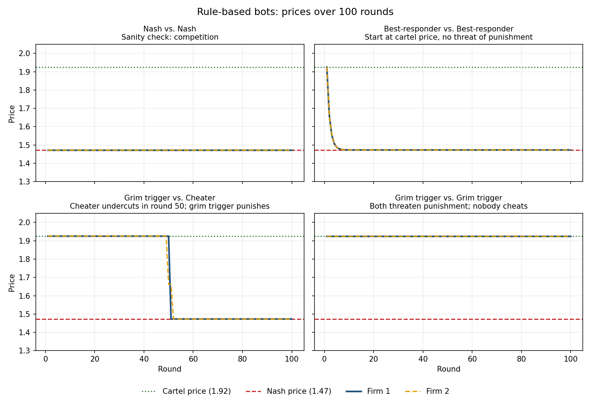

# Do AI Pricing Agents Tacitly Collude?

*Javen Chen · Harvard University · Letting Claude Cook first-year seminar, Fall 2026*

## The question

More and more companies are using artificial intelligence to set their prices. 
If each company allows an AI agent to set prices (and every agent is told only 
to maximize profit), will the agents compete towards lowering prices, or will 
they jack the prices higher and higher, hurting consumers in the process?

A **cartel** is a group of firms that agree to keep prices high instead of
competing. Explicit cartels are illegal. **Tacit collusion** reaches the same
high prices with no agreement at all. Each firm simply learns that undercutting
its rival sets off a price war. Antitrust law mostly punishes agreements, so if
AI agents learn to collude tacitly, it isn't clear current law can stop them.

This project builds on Fish, Gonczarowski & Shorrer, who found that AI pricing
agents based on GPT-4 reached above-competitive prices on their own (full
citation [below](#reference)). I rebuild their market from scratch, check that
it works, and then test how the result depends on the agents' instructions, on
whether they can communicate, and on how many firms compete.

## Status

| Stage | What | Status |
|---|---|---|
| 1 | Build the market; verify it with simple rule-based bots | **Done** |
| 2 | Replace the bots with AI (LLM) pricing agents | Next |
| 3 | Vary one thing at a time: instructions, communication, number of firms | Planned |

The findings below come from **Stage 1 only**. No AI agents have been run yet.

## Method

### The market

Two firms sell similar but not identical products (think Coke and Pepsi).
Every round, each firm picks a price at the same time. Customers then choose
which one to buy, or buy nothing. A game lasts 100 rounds, and each firm sees
every past price before choosing its next one.

How many customers each firm gets follows the **logit demand** model used in
the paper (and originally in Calvano et al., 2020):

$$
q_i = \beta \cdot \frac{e^{(a_i - p_i/\alpha)/\mu}}{\sum_j e^{(a_j - p_j/\alpha)/\mu} + e^{a_0/\mu}}
\qquad\qquad
\pi_i = (p_i - \alpha c_i)\, q_i
$$

In plain language:

- **$q_i$** is how many units firm *i* sells. **$\pi_i$** is its profit.
- **$p_i$** is firm *i*'s price.
- **$a_i = 2$** is how good the product is. Higher quality attracts more buyers.
- **$a_i - p_i$** is roughly the "deal" a customer gets: quality minus price.
- **$e^{(\ldots)}$** (exponential) turns that deal into an attractiveness score
  that's always positive. A slightly better deal gives a much higher score.
- **The fraction** is each firm's share of the market: its score divided by
  the total score of all the options.
- **$e^{a_0/\mu}$ with $a_0 = 0$** is the score of the **outside option**,
  meaning buying nothing. It's why raising prices loses some customers entirely,
  not just to the rival.
- **$\mu = 0.25$** measures how different the products feel. A small $\mu$
  means customers switch to the cheaper firm easily. A large $\mu$ means they
  stay loyal.
- **$c_i = 1$** is the cost of making one unit, so profit is (price − cost) ×
  units sold.
- **$\beta = 100$** and **$\alpha = 1$** only change the units (100 customers,
  prices in dollars). They don't change the economics.

### The two benchmarks

These two prices are the yardsticks for everything else:

| Benchmark | Meaning | Price | Profit per firm per round |
|---|---|---|---|
| **Competitive (Nash) price** | Each firm charges its best price *given* the other's price, so neither wants to change. What real competition produces. | **1.47** | 22.3 |
| **Cartel (monopoly) price** | The price that maximizes the two firms' *combined* profit, as if one company owned both. | **1.92** | 33.7 |

Colluding pays about 51% more profit than competing. My code calculates both
prices from the demand formula, and they match the values in the paper (1.47
and 1.92), which confirms that the market is built correctly.

### Testing with simple bots

Before paying for AI agents, I ran the market with bots that follow fixed
rules:

- **Nash bot:** always charges the competitive price.
- **Cartel bot:** always charges the cartel price.
- **Best-responder:** each round, charges whatever would have earned the most
  against the rival's last price. It's short-sighted and never thinks about
  retaliation.
- **Grim trigger:** charges the cartel price until the rival undercuts even
  once, then charges the competitive price forever as punishment.
- **Cheater:** cooperates at the cartel price, secretly undercuts in round 50,
  and plays short-sighted best responses after that.

## Stage 1 findings



1. **The market behaves as theory predicts.** Two Nash bots stay at 1.47. Two
   cartel bots stay at 1.92.
2. **High prices collapse without a threat of punishment.** Two best-responders
   that start at the cartel price undercut each other down to the competitive
   price within about 6 rounds. Being short-sighted is enough to make them
   compete.
3. **A credible threat keeps prices high.** Two grim-trigger bots hold the
   cartel price for all 100 rounds. Neither was told to collude. Each bot just
   follows "I'll keep prices high as long as you do."
4. **Cheating doesn't pay against a punisher.** The cheater earns 41.2 instead
   of 33.7 in the round it undercuts (+7.4). After that, punishment drops it to
   22.3 per round. Over the game it earns **568 less (−17%)** than if it had
   stayed loyal.

**Why this matters for the AI experiments:** tacit collusion doesn't need a
secret agreement. It only needs each firm to *expect* retaliation if it cuts
prices. Stage 2 asks whether AI agents, told nothing except to maximize profit,
work out that logic by themselves.

## How this was built

This project is part of a seminar about using AI agents to do research, and
most of the code was written by an AI coding agent (Claude Code) working under
my direction. My job was to make the research decisions: the question, the
experimental design (two firms and 100 rounds, the benchmarks, testing with
bots before adding AI), what to vary, and how to interpret the results.
Checking the agent's work, for example confirming that our benchmark prices
match the published paper, was part of that job.

## Reproduce it

```bash
python3 -m venv .venv                          # from the repo root
.venv/bin/pip install -r pricing-collusion/requirements.txt
cd pricing-collusion
../.venv/bin/python market.py                  # prints the two benchmarks
../.venv/bin/python run_bot_tests.py           # runs the bots, saves CSVs + chart to results/
```

| File | What it does |
|---|---|
| `market.py` | Demand, profit, and the Nash and cartel benchmark prices |
| `bots.py` | The rule-based pricing bots |
| `simulate.py` | Runs a repeated game between two bots and records every round |
| `run_bot_tests.py` | Runs all bot matchups, prints a summary, and makes the chart |

## Reference

Fish, S., Gonczarowski, Y. A., & Shorrer, R. I. (2024). *Algorithmic Collusion
by Large Language Models.* arXiv:2404.00806.
[https://arxiv.org/abs/2404.00806](https://arxiv.org/abs/2404.00806)

The market design follows Calvano, E., Calzolari, G., Denicolò, V., &
Pastorello, S. (2020). Artificial Intelligence, Algorithmic Pricing, and
Collusion. *American Economic Review*, 110(10), 3267–3297.
